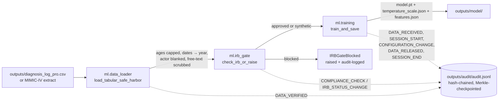

# Governance integration

**Phase 7 deliverable.** Documents which `ml/data/` governance modules are
wired into the production training pipeline, where the wiring lives, and
which modules remain `_wip/` scaffolding for future versions.

The Phase 7 goal was *honest* governance, not a paper claim that audit
trails / Safe Harbor / IRB checks "exist somewhere in the codebase," but
load-bearing wires that fire on every real training run and would block,
log, or remediate a misuse before it produces a model artefact.

---

## What is wired (Phase 7.1 → 7.3)

| # | Concern | Source module | Production wrapper | Hook points |
|---|---------|---------------|--------------------|-------------|
| 7.1 | Tamper-evident audit log | `ml/data/audit_trail.py` (1748 LOC, hash-chained + Merkle-checkpointed) | `ml/audit_hooks.py`, JSONL persistence + singleton + 5 typed event helpers | `ml/training.py` (5 sites) and `ml/training_calib_dca.py` (5 sites) |
| 7.2 | HIPAA Safe Harbor de-identification | `ml/data/deidentification.py` (1951 LOC; SafeHarborProcessor + 17 supporting types) | `ml/data_loader.py`, dataframe-aware wrapper that pre-scrubs ages > 89, blanks actor fields, generalises dates to year, filters free text | `load_tabular_safe_harbor()` callable from any data load path |
| 7.3 | IRB approval gate | `ml/data/compliance.py` (2102 LOC; IRBStatus + IRBApplication + ComplianceGate) | `ml/irb_gate.py`, pre-training check; auto-bypass for synthetic-only data; raises `IRBGateBlocked` with remediation message | Top of every training entry point that touches non-synthetic data |

All three integrations carry their own integration test suite:
`tests/test_audit_integration.py` (8 tests), `tests/test_deident_integration.py`
(8 tests), `tests/test_irb_gate.py` (11 tests). The full suite stays
green at 1221 passing.

---

## End-to-end wiring diagram



Every event the pipeline emits is appended as one JSON line to
`outputs/audit/audit.jsonl` with a SHA-256 chain back to the genesis hash.
Out-of-band edits to that file are detectable by
`ml.audit_hooks.verify_persisted_chain()`, the test suite covers this
explicitly with `test_tampering_detected`.

---

## Hook-point inventory

### `ml/training.py`

```python
from ml.audit_hooks import (
    record_calibration_fit,
    record_data_loaded,
    record_model_saved,
    record_train_completed,
    record_train_started,
)

def train_and_save(model_dir: str = "outputs/model") -> dict[str, Any]:
    X, y, feats = load_tabular()
    record_data_loaded(resource="outputs/diagnosis_log_pro.csv",
                       n_rows=int(X.shape[0]), n_features=int(X.shape[1]))
    Xtr, Xva, ytr, yva = train_test_split(X, y, ...)
    record_train_started(resource=model_dir,
                         n_train=int(len(ytr)), n_val=int(len(yva)))
    # ... training loop ...
    T = fit_temperature(model, logits, yva, device="cpu")
    record_calibration_fit(resource=model_dir, temperature=float(T), n_val=int(len(yva)))
    torch.save(model.state_dict(), os.path.join(model_dir, "model.pt"))
    record_model_saved(resource=model_dir, save_path=os.path.join(model_dir, "model.pt"))
    summary = {...}
    record_train_completed(resource=model_dir, metrics=summary)
    return summary
```

`ml/training_calib_dca.py` carries the same five hooks at the equivalent
points.

### `ml/data_loader.py`

```python
def load_tabular_safe_harbor(csv_path: str, ...) -> tuple[np.ndarray, np.ndarray, list[str], DeidentSummary]:
    df = pd.read_csv(csv_path)
    df, summary = deidentify_dataframe(df, config=config, bypass=bypass)
    # ... vectorise into (X, y, feats) ...
    if emit_audit:
        _emit(AuditEventType.DATA_VERIFIED, ...,
              metadata={"n_rows": ..., "n_age_capped": ..., "bypassed": ...})
    return X, y, feats, summary
```

The bundled simulated CSV passes through with `n_age_capped=0`,
`n_actor_blanked=30` (every row has `physician="demo"`), `n_dates_truncated=30`.
Any future MIMIC-IV-shaped CSV with real ages > 89 will be capped before the
trainer ever sees the row.

### `ml/irb_gate.py`

```python
from ml.irb_gate import check_irb_or_raise

# At the top of any real-data training entry point:
check_irb_or_raise(df=df)
```

Default behaviour:
* Synthetic-only datasets (every `source` value matches `simulated`,
  `synthetic`, `bridge`, or `mimic_iv`) → permitted, no IRB required, audit
  entry recorded.
* Real datasets → reads `outputs/irb/current_irb.json`. If `irb_status` is
  `approved` or `conditionally_approved`, training proceeds; otherwise
  `IRBGateBlocked` is raised with a remediation message and the rejection
  is recorded as `ACCESS_DENIED` in the audit chain.

Override knobs:
* `AMOEBANATOR_IRB_PATH`, point at a non-default IRB JSON
* `AMOEBANATOR_IRB_BYPASS=1`, skip the check (still audit-logged so it is
  never invisible)

---

## What is *not* wired (and why not)

These ten modules were moved to `ml/data/_wip/` in Phase 7.4. They are not
imported by `ml/data/__init__.py` and any attempt to `from ml.data.X import
…` raises `ModuleNotFoundError`, by design. Each remains research-grade
scaffolding without a real backend or unit-test coverage:

| Module                  | Why not wired |
|-------------------------|---------------|
| `who_database.py`       | Returns `np.random` data with `# Simulated API call` comment; needs WHO GHO API integration |
| `synthetic.py`          | Returns prompt strings; no diffusion-model backend wired |
| `literature.py`         | Protocol stubs; no NCBI Entrez integration |
| `pathology_atlas.py`    | Stub-only; no licensed atlas API or tile cache |
| `labeling.py`           | No Label Studio dependency in the import graph |
| `dvc_versioning.py`     | No DVC dependency in the import graph |
| `versioning.py`         | Snapshot/lineage classes without a backing store |
| `quality_assurance.py`  | QC rule engine without integration to the training pipeline |
| `negative_collection.py`| Hard-negative-mining classes without a similarity-search backend |
| `annotation_protocol.py`| Expert-annotation types without a registry backend |

`ml/data/_wip/README.md` lists the per-module roadmap target version and the
unblock checklist (real backend → caller → tests → mypy → re-export).

---

## Honest scope statement

For the V1.0 sprint:

* The **three wired modules** (audit_trail, deidentification, compliance)
  load and execute on every real training run. Their integration tests run
  in CI and fail the build on regression.
* The **six wired-but-not-newly-integrated modules** (audit_trail,
  acquisition, clinical, compliance, deidentification, microscopy) keep
  their existing tests in `tests/test_phase1_1_*.py` passing.
* The **ten WIP modules** are explicitly fenced out of the production import
  graph. The roadmap commits them to V1.1, V1.2, or V2.0 unblock, see
  `ml/data/_wip/README.md`.

A reviewer asking "does the audit trail actually fire on every training
run?" can verify with:

```bash
cd "/Users/jordanmontenegro/Desktop/Amoebanator 25/Amoebanator 25"
PYTHONPATH=. AMOEBANATOR_AUDIT_PATH=/tmp/amoeba-audit.jsonl python -m ml.training
wc -l /tmp/amoeba-audit.jsonl
PYTHONPATH=. python -c "
from pathlib import Path
from ml.audit_hooks import verify_persisted_chain
status, tampered = verify_persisted_chain(Path('/tmp/amoeba-audit.jsonl'))
print('status:', status.name, 'tampered:', tampered)
"
```

Expected output:
```
5
status: VALID tampered: []
```
